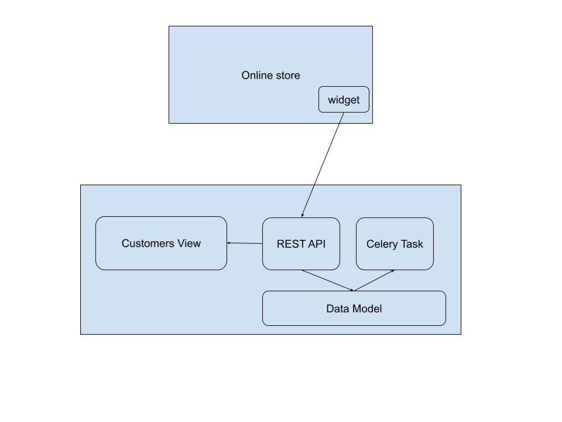

# Full-stack Software Engineering at Konigle 
Thank you for interviewing with us! Konigle is a collection of tools to help an online store scale. These tools help an online store save time, reduce costs and increase sales, hence improve their profitability. 

Konigle is a complex product being shipped at very high velocity to solve urgent and important needs for online stores. To help us ship fast, we have architected our product around a tech stack that is simple and well understood. Konigle is a web first product and each seller tool inside Konigle is a Django application with it's own data models and simple UI. 

As a full stack engineer, you would have an opportunity to build, maintain and scale complete seller tools. In order to give you the feel of the actual work that you will be doing, this task in itself is a hypothetical toy seller tool that should take you not more than 4 hours to prototype. Let's call this 
seller tool --> *Unity*

## Unity
Creating an email list with consent to target with promotional emails is a cost effective way to increase sales. Infact, studies have shown that email
marketing has ~42000% ROI. Unity is a simple seller tool that helps an online store maintain an email list. It consists of a widget installed an online store and a Django application which will provide the ability to manage these new customers.

Here is the brief functionality of the seller tool
- A widget pops up on the online store and prompts the store visitor to signup using email address
- The signup data will be sent to an API provided by the Django app (Unity backend)
- The app stores the data in its own model
- The app exposes a view which 
	1.  lists down the emails in the reverse chronological order of their  timestamp
	2. Shows the number of new emails in the current calendar month
- The app sends an email to the seller every Monday and Wednesday including the statistics around the email list

## Task
Build a Django application with following functionalities
1. Exposes an API to store the emails. Feel free to use Django REST Framework
2. A view to list down the emails in the reverse chronological order and show the number of new emails added this calendar month
3. Integrate the api with the email collection widget present in this project.
3. Bonus - setup a celery task that runs every Monday and Wednesday and prints the number of new emails added in the current calendar month to the console.

 _NOTES_
 - The widget itself sits on seller's online store (3rd party site) and sends data to your app (Konigle). The API is public but we don't want anyone to misuse it.

## Steps
1. Download the attached zip file which is a git repo. The repo already contains the following
    - `widgets` - a Javascript project for creating the widget. This includes the webpack based toolchain to generate the widget's JS file. If you are not comfortable with all these, don't worry about it.
    - `static/js/e-widgets.v1.min.js` - The widget's javascript file to be included in the seller's online store. You need to configure your Django project to serve this static file to any online store.
    - `widgets/test/store.html` - A test HTML file which includes the widget. 
2. Create a Django project inside the repo.
3. Create Django app with name - unity.
4. Create a data model to store the emails.
5. Expose an REST API to be used by the widget to submit the email data.
6. Create a Django view for listing the emails. Below is a sample Figma design for your reference
7. Bonus - Create a celery periodic task that does what is specified above

## Submission
Zip the working repo and email us

**OR**

Push it to your own git repo and share a link. This way you have a useful, working project against your profile!

